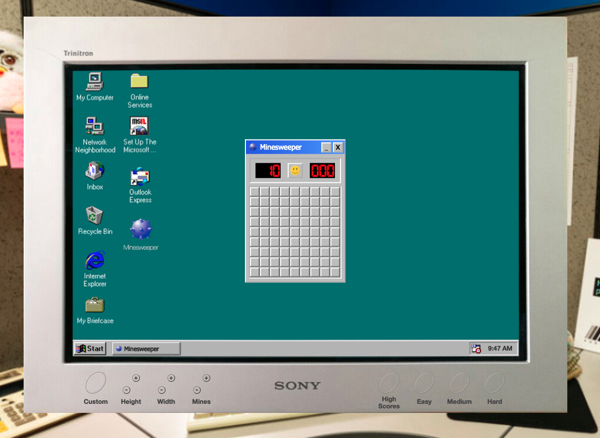

# **_MINESWEEPER_**

A classic game deserving of a classic feel. [Play it now!](https://alicnik.github.io/minesweeper/) (Best viewed on desktop in full screen.)



## GOAL

To design and implement a faithful reproduction of the classic Windows game Minesweeper, paying tribute not only to the functionality, but also the playing environment.

## HTML

As this was a vehicle for DOM manipulation, the HTML structure is simple with few surprises. There is use of the dataset throughout to facilitate interaction between the script and the HTML.

## CSS

Design was modelled on the classic Windows 95/XP UI, with a photo of an old CRT monitor merged with a screenshot of the original desktop layout. A Minesweeper "icon" was added to the desktop for authenticity and additional interaction. To ensure authenticity, user select and cursor: pointer have been removed throughout as a style choice. Borders are `inset/outset white 2px` throughout, per original game.

Smiley face button designed for this game with influence from Watchmen on game over. Sporadic use of active and hover pseudo-classes to mimic original functionality and UI.

Difficulty buttons "merged" into the plastic of the CRT monitor display for additional visual sugar. Pseudo-elements used in grid (more 3D than border) and on difficult buttons to mimic the cutout of the plastic button.

Simple mobile display with echoes of 90s 'Word Art' in pseudo-element title. Removed one difficulty button as grid too large for mobile displays.

Various classes stipulated to allow for DOM manipulation.

## JAVASCRIPT

### 1. Initial setup

To allow for different board sizes, dynamic grid generation is employed in `drawMinefield()`. The number of tiles and mines is determined by the height, width and mines variables. These can be changed dynamically by clicking the difficulty buttons, with the new values for the variables being taken from each button dataset.

On generation, tiles are assigned CSS classes and a data.index value that keeps track of their order of creation. Event listeners for the primary click events (see below) are added. Tile is pushed to the DOM in `div.grid`.

Tile is also stored as an object in an array with various properties: element (a representation of the DOM element); `adjacentTiles` (a record of the tiles above, below, to each side, and at each corner of each tile in the grid, calculated by a helper function); `isFlagged`, `clicked`, and `recursed`, all of which are Booleans to facilitate comparisons between tiles; and the `index`, placed here as well as on the DOM element to facilitate access whether approaching via DOM or through internal code.

At this point, the tiles are all blank and there are no mines.

### 2. Primary Click Events

`clickTile()`: the central interaction element of the game uncovers the clicked tile.

```
function clickTile(event) {
  if (tilesArray.every(tile => !tile.clicked)) {
    startTimer()
    populateMines()
    const clickedTile = tilesArray[event.target.dataset.index]
    while (clickedTile.adjacentTiles.some(adjacentTileIndex => mineLocations.includes(adjacentTileIndex)) ||
      mineLocations.includes(clickedTile.index)) {
      populateMines()
    }
    revealClicked(event)
  } else if (!event.target.classList.contains('flag')) {
    revealClicked(event)
  }
  checkProgress()
}
```

If no tiles have been clicked, the game timer is started and mines are placed on the grid per the `populateMines()` and `placeMine()` functions.

```
function populateMines() {
  mineLocations = []
  for (let i = 0; i < mines; i++) {
    placeMine()
  }
}

function placeMine() {
  const mineLocation = Math.floor(Math.random() * width * height)
  mineLocations.includes(mineLocation) ? placeMine() : mineLocations.push(mineLocation)
}
```

`placeMine()` pushes to the mines array a series of random indexes from the maximum number of tiles of the generated grid and will run again if the same index is generated twice, ensuring mines are not placed on the same tile twice. `populateMines()` runs `placeMine()` for as many mines as are needed. In `clickTile()`, `populateMines()` is run until the first tile clicked is neither adjacent to a mine nor a mine. In the original game, the first click is always a blank square. The `revealClicked()` function (see below) then runs.

If it is not the first click, then the `revealClicked()` function runs as long as the tile does not have a flag on it.

After every click, a check runs to see whether all tiles without mines have been clicked (which wins the game).

`flagTile()`: secondary interactive element allowing for placement of a flag to indicate that the user suspects a mine is beneath that tile.

```
function flagTile(event) {
  event.preventDefault()
  addOrRemoveFlag(event.target)
}

function addOrRemoveFlag(clickedTile) {
  //? Prevent flag placement on first click
  if (tilesArray.every(tile => !tile.clicked)) {
    alert('You can\'t place a flag yet, please uncover a tile first')
    return
  }
  //? Place flag only on tiles that are not flagged and have not been clicked; remove flag from tiles that have not been clicked (to avoid changing state of clicked tile)
  if (!tilesArray[clickedTile.dataset.index].isFlagged && !tilesArray[clickedTile.dataset.index].clicked) {
    addAndRemoveClass(clickedTile, 'flag', 'tile-initial')
    tilesArray[clickedTile.dataset.index].isFlagged = true
    inGameMineCount--
  } else if (!tilesArray[clickedTile.dataset.index].clicked) {
    addAndRemoveClass(clickedTile, 'tile-initial', 'flag')
    tilesArray[clickedTile.dataset.index].isFlagged = false
    inGameMineCount++
  }
  updateMineCounterDisplay()
}
```

This runs the `addOrRemoveFlag()` function, which adds/removes a flag depending on current `isFlagged` status of the tile. This adds a class in the DOM (flag picture) to the tile and updates the mine counter display. A guard clause is also present to ensure that the first click is not an attempt to place a flag—functionality from the original game again.

### 3. Gameplay Functions

`revealClicked()`: primary gameplay function reveals what is underneath the clicked tile as long as the tile has not been flagged.

```
function revealClicked(event) {
  const clickedTile = event.target
  const clickedTileIndex = Number(clickedTile.dataset.index)
  if (tilesArray[clickedTileIndex].isFlagged) return
  tilesArray[clickedTileIndex].clicked = true
  if (mineLocations.includes(clickedTileIndex)) {
    gameOver(clickedTileIndex)
  } else if (adjacentMineCount(clickedTileIndex) === 0) {
    clickedTile.classList.remove('tile-initial')
    revealExtended(clickedTileIndex)
  } else {
    const numberClass = `adjacent-mines-${adjacentMineCount(clickedTileIndex)}`
    addAndRemoveClass(clickedTile, numberClass, 'tile-initial')
  }
}`
```

The tile object of the clicked tile in `tilesArray` is updated so `clicked === true`. It a mine is on that tile, `gameOver()` function (see below) runs. If the tile has 0 mines in any of the adjacent tiles, `revealExtended()` (see below) runs. Otherwise, a class with a depiction of a number of mines adjacent to that tile is added to the clicked tile.

`revealExtended()`: in the original game, clicking on an empty tile uncovers not only that tile but also the blank tiles around it, those blank tiles in turn will act as if they have been clicked and uncover any blank tiles around it, and so on. This recursive functionality is contained in the `revealExtended()` function.

```
function revealExtended(tileIndex) {
  tilesArray[tileIndex].adjacentTiles.forEach(adjacentTileIndex => {
    if (adjacentMineCount(adjacentTileIndex) === 0 && !tilesArray[adjacentTileIndex].recursed) {
      addAndRemoveClass(tilesArray[adjacentTileIndex].element, 'adjacent-mines-0', 'tile-initial')
      tilesArray[adjacentTileIndex].recursed = true
      tilesArray[adjacentTileIndex].clicked = true
      revealExtended(adjacentTileIndex)
    } else if (mineLocations.includes(adjacentTileIndex)) {
      return
    } else {
      const numberClass = `adjacent-mines-${adjacentMineCount(adjacentTileIndex)}`
      addAndRemoveClass(tilesArray[adjacentTileIndex].element, numberClass, 'tile-initial')
      tilesArray[adjacentTileIndex].clicked = true
    }
  })
}
```

This assesses the tiles adjacent to the initially clicked tile and, if one of the adjacent tiles is blank, runs the same assessment on that tile. As it checks, it marks the recursion check in the tile object so that tile is not assessed again so as to avoid too much recursion error. If an adjacent tile has a mine on it, then the function exits. If an adjacent tile is itself next to a mine, the appropriate class with the numerical depiction of the number of adjacent mines is placed.

For both these functions, the `adjacentTiles` property of each tile object in `tilesArray` is used alongside a helper function which tallies the number of mines present in the adjacent tiles, thereby determining which numerical depiction to assign.

### 4. Endgame Functions

`winGame()`: if all tiles without mines are clicked, the game is won.

```
function winGame() {
  clearInterval(timerInterval)
  userTime = timerCount - 1
  userDifficulty = calculateDifficulty()
  smileyButton.classList.add('sunglasses-smiley')
  addAndRemoveClass(grid, 'unclickable', 'clickable')
  //? Automatically place flags on mine tiles where user has clicked all non-mine tiles
  tilesArray.filter(tile => mineLocations.includes(tile.index)).forEach(tile => {
    tile.element.classList.add('flag')
  })
  minesRemaining.innerHTML = '0'
  if (userDifficulty) checkHighScores(userDifficulty, userTime)
}
```

It is not necessary to place a flag on each mine. Indeed, you could go the whole game without placing a single flag and still win. On win, the timer stops, the smiley face is updated, and any tiles with mines are given a flag automatically.

`gameOver()`: if player clicks on a mine, that mine explodes (a picture of a mine on a red background) and the locations of the other mines are revealed (pictures of mines on grey background).

```
function gameOver(clickedTileIndex) {
  clearInterval(timerInterval)
  smileyButton.classList.add('dead-smiley')
  //? Reveal mine locations
  mineLocations.forEach(mineLocationIndex => {
    if (mineLocationIndex !== clickedTileIndex) {
      addAndRemoveClass(tilesArray[mineLocationIndex].element,'undetected-mine', 'initial-tile')
    } else {
      addAndRemoveClass(tilesArray[mineLocationIndex].element,'exploded-mine', 'initial-tile')
    }
  })
  //? Reveal tiles incorrectly flagged as having a mine
  tilesArray.filter(tile => tile.isFlagged).forEach(tile => {
    if (!mineLocations.includes(tile.index)) {
      addAndRemoveClass(tile.element,'wrong-mine', 'flag')
    }
  })
  addAndRemoveClass(grid, 'unclickable', 'clickable')
}
```

If player has incorrectly flagged a tile as having a mine, another class is assigned which depicts a mine with a cross over it. Again, this mimics the operation of the original game.

For both of these functions, the grid becomes unclickable so no further action is possible until reset.

`reset()`: stops timer, resets displays and mine counts, draws a new blank minefield.

```
function reset() {
  clearInterval(timerInterval)
  smileyButton.classList = 'smiley-face'
  timer.innerHTML = '000'
  minesRemaining.innerHTML = mines
  inGameMineCount = mines
  drawMinefield()
}
```

### 5. Drag & Drop

Purely aesthetic to mimic the behaviour of a Windows 95 desktop. Certain elements are designated draggable. Mousedown on those elements makes the other elements non-interactive (dragging one over the other causes a clash due to z-index values) and additional `mousemove` and `mouseup` events are added to the element and to the wider document (mouseup on wider document because drag is limited to the dimensions of the depicted desktop, meaning the mouse may not be on the element when mouseup occurs).

```
const draggableElements = Array.from(document.querySelectorAll('.draggable'))

draggableElements.forEach(element => dragElement(element))

function dragElement(element) {
  let startingPosX, startingPosY, posChangeX, posChangeY
  const otherDraggableElements = draggableElements.filter(otherElement => otherElement !== element)

  element.addEventListener('mousedown', clickToDrag)

  function clickToDrag(e) {
    e.preventDefault()
    if (e.target.tagName === 'BUTTON') return
    otherDraggableElements.forEach(element => {
      element.parentElement.style.pointerEvents = 'none'
    })
    addAndRemoveClass(grid, 'unclickable', 'clickable')
    startingPosX = e.clientX
    startingPosY = e.clientY
    element.onmousemove = moveElement
    document.onmouseup = stopMoving
  }

  function moveElement(e) {
    e.preventDefault()
    e.target.classList.add('travelling')
    const { minx, maxx, miny, maxy } = element.parentElement.dataset
    posChangeX = startingPosX - e.clientX
    posChangeY = startingPosY - e.clientY
    startingPosX = e.clientX
    startingPosY = e.clientY
    const minMaxX = Math.min(Math.max(element.parentElement.offsetLeft - posChangeX, minx), maxx)
    const minMaxY = Math.min(Math.max(element.parentElement.offsetTop - posChangeY, miny), maxy)
    element.parentElement.style.left = `${minMaxX}px`
    element.parentElement.style.top = `${minMaxY}px`
  }

  function stopMoving(e) {
    otherDraggableElements.forEach(element => element.parentElement.style.pointerEvents = 'initial')
    if (e.target.classList.contains('travelling')) {
      desktopIcon.classList.remove('desktop-icon-container-active')
      e.target.classList.remove('travelling')
    }
    addAndRemoveClass(grid, 'clickable', 'unclickable')
    document.onmouseup = null
    element.onmousemove = null
  }
}
```

Move functionality is calculated by measuring the difference between the original and new position of the mouse. This difference is then subtracted from the initial offset of the parent container of the draggable element. These are run through `minMax` functions to keep the draggable area confined to the depicted desktop. The `minMax` value is then passed through to inline CSS, updating the position of the window dynamically. After the first movement, the new position is reassigned as the original position, so that when more movement occurs, the calculation continues and dragging movement occurs dynamically. `travelling` class is added on move to facilitate proper aesthetics of desktop icon click (below).

Movement is stopped on `mouseup`, `travelling` class is removed and pointer events restored. `Mousemove` and `mouseup` events are removed as the last stage of the `mouseup` event.

### 6. Close Button, Desktop Icon, and Desktop Clock

To simulate original functionality, a close button is added to the "title bar" of the game. This adds `display: none` to the game container and resets the game, mimicking the closure of a program in Windows. The desktop icon is clickable and draggable. Double clicking restores the display and visibility of the game container.

A visual indication that the desktop icon is selected was added on click. Bug was found where dragging the desktop icon was perceived as a click and icon was highlighted as if it had been clicked without dragging. This was resolved by tracking travelling through addition of a class in the `moveElement()` function, allowing for distinction between a drag and a click in situ. Actual event used to mimic selection highlighting was `mousedown` as this was more practical for control flow.

Desktop clock at bottom right updates in real time by running simple `setInterval()` on DOM content load.

### 7. Mobile Design

Since mobile phones do not have right click functionality, a button was added to allow the player to toggle whether they were placing flags or uncovering tiles. As with the full-size game, flags cannot be placed without uncovering at least one tile first. In JS, toggling this button swaps the event handler functions (`clickTile`() and `flagTile()`) for the click event on each tile.

## KEY LEARNINGS

This proved to be indispensable practice with the concept of recursion. It was also excellent CSS practice as a number of elements were visually dependent on a CSS background, which obviously had no inherent DOM properties to work with.

The greatest challenge was probably implementing drag and drop functionality with multiple items. This taught me the value of iterating over a problem and building upon working functionality in an incremental manner.

Perhaps most of all, it taught me the value of working on a project you really enjoy.

## CONCLUDING REMARKS

I was immediately drawn to recreating this game for my first JavaScript project as it evoked a number of childhood memories for me. This was likely the reason for the 90s aesthetic and design choices. I believe that the game functionality is an accurate representation of the original game, but I would welcome any observations or amendments from those who remember it better/differently.

This was a good introduction to simple recursion and the limits/functionality of same. While not part of the game, the challenges of mimicking Windows dragging and selection functionality in a JS environment were particularly engaging and rewarding.

More than anything, I hope you enjoy the game and that it brings back some good childhood memories for you, too.

## FUTURE GOALS

- Since I had more time to implement extra features than originally envisaged, I believe that some of the CSS naming could be smoothed out.
- Having established a mathematical formula for dragging boundaries, I believe that this could replace the dataset in the HTML code.
